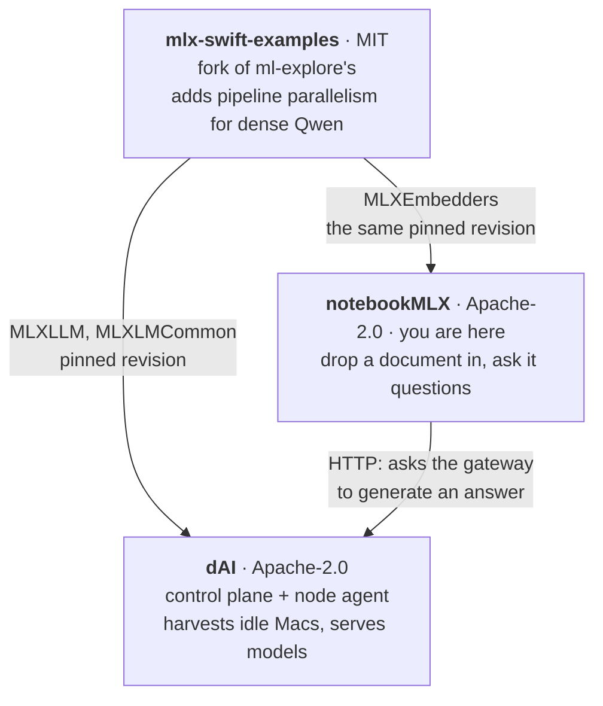

# notebookMLX

Drop a document in, ask it questions, and get answers whose citations open the
passage they name.

Embedding happens **on the machine**, through `MLXEmbedders` - the documents
never leave it. Generation is answered by a [dAI](https://github.com/djsincla/dAI)
gateway, which is itself a fleet of local machines, so the same holds there.

## Three repositories, and how they fit

**This one is the app.** It is a client of a dAI fleet, and it shares that
project's fork of Apple's MLX examples rather than borrowing a copy.

| | What it is |
|---|---|
| **[notebookMLX](https://github.com/djsincla/notebookMLX)** | This app. Ingests documents, embeds and indexes them locally, answers with citations that resolve to a page. |
| **[dAI](https://github.com/djsincla/dAI)** | The fleet behind the answers: idle Apple Silicon machines, centrally scheduled, serving models over an OpenAI-compatible gateway. Nothing leaves the building. |
| **[mlx-swift-examples](https://github.com/djsincla/mlx-swift-examples)** | The fork both depend on. `MLXEmbedders` here, `MLXLLM` there, one pinned revision for both. |

Without a gateway configured the app still ingests, embeds and searches - that
part is entirely local. It is generation that needs the fleet.

## What it does

- Ingests PDF, plain text and xlsx. A spreadsheet is a zip of XML, which is why
  `CoreXLSX` is a dependency rather than something written here.
- Chunks, embeds and indexes locally, with pooling chosen by model family
  because the conversions do not ship a `1_Pooling` directory to read it from.
- Answers with citations that resolve to a page, and an evidence column beside
  the answer rather than footnotes underneath it.
- Says when an answer was cut off, and what cut it.

## Building

    swift build

The app bundle is assembled by `packaging/make-app.sh`, which wraps the built
executable - a menu-bar-free document app needs an `Info.plist`, and SwiftPM
produces a bare binary.

Command-line tools alongside the app: `notebook-ingest` (one document, with
memory reported as it goes), `notebook-import` (adopt an existing index),
`notebook-reembed` (re-embed keeping chunks and citations), `notebook-verify`
(check this embedder against the agent's fixture), and `notebook-demo`.

## The pinned fork

`Package.swift` pins
[djsincla/mlx-swift-examples](https://github.com/djsincla/mlx-swift-examples) to
an exact revision, and **dAI pins the same one**. Both use `MLXEmbedders`; two
copies at different revisions could pool or normalise differently, and an index
built by one would be silently incomparable with a query from the other. That
is not a failure anything reports, so `Tests` asserts the two agree.

## Security

It parses documents it did not write and holds a gateway key in the Keychain.
[`SECURITY.md`](SECURITY.md) says how to report something, and what those two
facts mean.

## Licence

Apache License 2.0, © 2026 Dwayne Sinclair - see [LICENSE](LICENSE) and
[NOTICE](NOTICE). The pinned fork is MIT and is not covered by that notice.

Model weights are not in this repository and carry their own licences.
